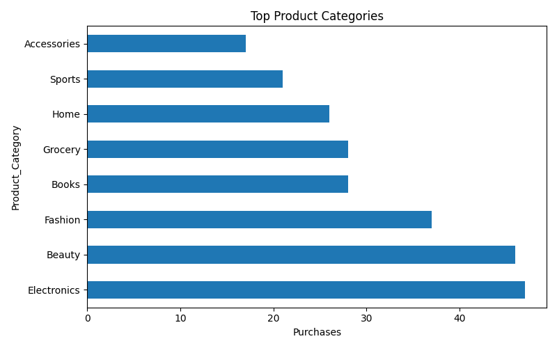
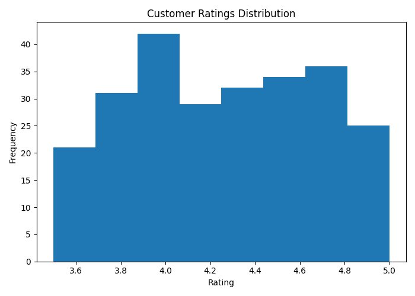
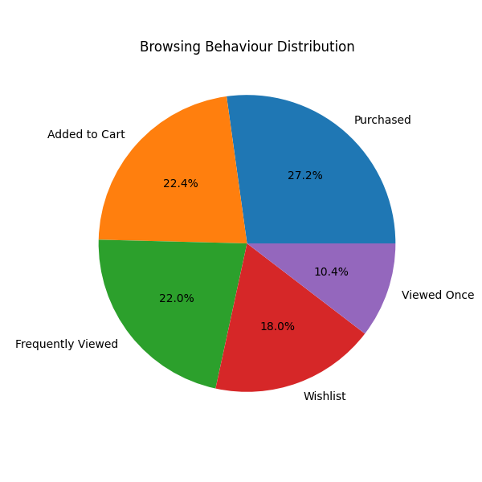
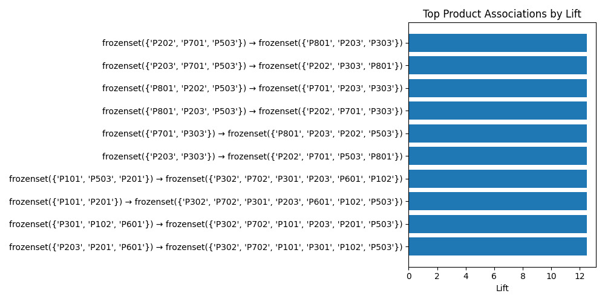

# 🛒 ShopEase E-Commerce Product Recommendation using KNN

<p align="center">
  
  
  
  
</p>

A Data Science project that builds a personalized product recommendation system using **Association Rule Mining (Apriori)** and **K-Nearest Neighbors (KNN)** to understand customer preferences and recommend relevant products.

---

## Project Overview

Online retailers collect customer purchase history, ratings, and browsing behaviour every day. Instead of showing the same products to every customer, businesses can use recommendation systems to personalize shopping experiences, increase cross-selling opportunities, and improve customer satisfaction.

This project combines:

- Data Cleaning
- Exploratory Data Analysis
- Product Association Analysis
- KNN-based Recommendation System
- Business Insights & Action Plan

---

## Problem Statement

An e-commerce company wants to answer:

- Which products are frequently purchased together?
- What are customers' preferred product categories?
- Which products should be recommended next?
- How can Support, Confidence, and Lift improve cross-selling?
- Can similar customers receive personalized recommendations?

The goal is to build a recommendation system that understands customer-product relationships rather than relying on a black-box prediction alone.

---

## Objectives

- Clean and validate customer purchase data.
- Perform exploratory data analysis.
- Identify customer preferences.
- Discover frequent product associations.
- Evaluate Support, Confidence, and Lift.
- Build a KNN recommendation model.
- Generate practical business recommendations.

---

## Dataset

A realistic **ShopEase mock dataset** containing **250 customer purchase records**.

### Features

| Column | Description |
|--------|-------------|
| Customer_ID | Customer identifier |
| Product_ID | Product identifier |
| Product_Category | Product category |
| Purchase_History | Purchase status |
| Rating | Customer rating |
| Browsing_Behaviour | Customer browsing behaviour |
| Transaction_Date | Purchase date |

After cleaning, the dataset retains more than **200 valid records**.

---

## Tech Stack

| Category | Technology |
|----------|------------|
| Language | Python |
| Notebook | Jupyter Notebook (Google Colab) |
| Data Analysis | Pandas, NumPy |
| Visualization | Matplotlib |
| Association Rules | mlxtend (Apriori) |
| Machine Learning | Scikit-learn (KNN) |
| Model Saving | Joblib |
| Version Control | Git & GitHub |

---

## Project Workflow

```text
Mock Dataset
      │
      ▼
Google Drive Mount
      │
      ▼
Data Cleaning
      │
      ▼
Exploratory Data Analysis
      │
      ▼
Apriori Algorithm
(Support • Confidence • Lift)
      │
      ▼
KNN Recommendation Model
      │
      ▼
Model Evaluation
      │
      ▼
Business Insights
      │
      ▼
Practical Action Plan
```

---

## Visualizations

All visualizations are generated using **Matplotlib** and stored inside `outputs/charts/`.

### 1. Top Product Categories

Shows which product categories receive the highest number of purchases.

<p align="center">
  
</p>

---

### 2. Customer Ratings Distribution

Displays how customers rate products across the platform.

<p align="center">
  
</p>

---

### 3. Browsing Behaviour Distribution

Shows customer interaction patterns before purchasing.

<p align="center">
  
</p>

---

### 4. Top Product Associations by Lift

Visualizes the strongest product combinations discovered using Apriori.

<p align="center">
  
</p>

---

## Association Rule Mining

The **Apriori Algorithm** was used to discover products frequently purchased together.

### Metrics Used

| Metric | Description |
|---------|-------------|
| Support | Frequency of product combinations |
| Confidence | Probability of purchasing Product B after Product A |
| Lift | Strength of the recommendation |

Generated rules are stored in:

```text
outputs/association_rules.csv
```

---

## KNN Recommendation Model

A customer similarity recommendation engine was built using:

- Cosine Similarity
- K = 5 Nearest Neighbours

The trained model is saved in:

```text
models/knn_recommendation_model.pkl
```

---

## Model Evaluation

The recommendation model is evaluated using customer similarity.

| Metric | Result |
|---------|---------|
| Algorithm | KNN |
| Similarity Metric | Cosine |
| K Value | 5 |
| Customers Analysed | 50 |
| Average Similarity Score | Generated during execution |

Evaluation results are stored in:

```text
outputs/model_metrics.txt
```

---

## 7 Key Insights

1. Electronics received the highest customer engagement across all categories.
2. Smartphones and Wireless Earbuds were frequently purchased together.
3. Coffee and Cookies formed one of the strongest association rules with high Lift values.
4. Added-to-Cart users showed higher purchase intent than Wishlist users.
5. Customers giving ratings above 4 demonstrated stronger repeat purchasing behaviour.
6. KNN successfully identified customers with similar shopping patterns for personalized recommendations.
7. High-Lift association rules can significantly improve cross-selling opportunities.

---

## Practical Action Plan

| Business Finding | Recommended Action |
|------------------|--------------------|
| Smartphone + Earbuds | Create Bundle Offers |
| Laptop + Mouse | Cross-Sell Together |
| Coffee + Cookies | Combo Promotions |
| Wishlist Customers | Send Discount Coupons |
| Repeat Buyers | Loyalty Rewards |
| Similar Customers | Personalized Recommendations |
| High-Lift Products | Homepage Product Suggestions |

---

## Project Structure

```text
ecommerce-product-recommendation-knn/
│
├── data/
│   ├── ecommerce_mock_dataset.csv
│   └── ecommerce_cleaned.csv
│
├── models/
│   └── knn_recommendation_model.pkl
│
├── notebooks/
│   └── Ecommerce_Product_Recommendation.ipynb
│
├── outputs/
│   ├── charts/
│   │   ├── top_categories.png
│   │   ├── rating_distribution.png
│   │   ├── browsing_behaviour.png
│   │   └── top_associations.png
│   ├── association_rules.csv
│   ├── customer_preferences.csv
│   ├── insights.txt
│   ├── action_plan.txt
│   └── model_metrics.txt
│
├── README.md
└── requirements.txt
```

---

## Installation

Clone the repository.

```bash
git clone https://github.com/Rukshana-S/ecommerce-product-recommendation-knn.git
```

Navigate into the project.

```bash
cd ecommerce-product-recommendation-knn
```

Install dependencies.

```bash
pip install -r requirements.txt
```

Run Jupyter Notebook.

```bash
jupyter notebook
```

Open:

```text
notebooks/Ecommerce_Product_Recommendation.ipynb
```

---

## Future Enhancements

- Real-time personalized recommendations
- Collaborative filtering
- Deep Learning recommendation models
- Homepage recommendation engine
- Customer segmentation

---

## Author

**Rukshana S**

B.E. Computer Science & Engineering

Sri Eshwar College of Engineering

GitHub: **Rukshana-S**

---

## Conclusion

This project demonstrates how **Association Rule Mining** and **K-Nearest Neighbors** can be combined to build an effective e-commerce recommendation system. By analyzing customer preferences, discovering high-value product associations, and recommending products based on customer similarity, the solution helps improve user experience, increase cross-selling opportunities, and support data-driven business decisions.